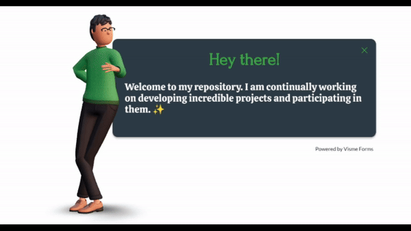

<h1 align="center">🌍 Hi 👋, I'm Juan Esteban Ramirez | Full Stack Web Developer 👨‍💻 </h1>

  

<pre>
💻 I am developing my skills as a Full Stack Developer | Enthuastic about new technologies
🌱 Focusing on Learning about people needs and making their lives easier
🌟 Interested in full stack web development and machine learning application development
</pre>

## 🚀 Technologies & Tools
### <u> 🖥️ Frontend </u>

### <u> ⚙️ Backend </u>
 

### <u> 📊 Data Analysis </u>

### <u> ⚡ Others </u>

  
  

  

  <h3><b>Let's get in touch! </b></h3>
  

 &nbsp;&nbsp;

